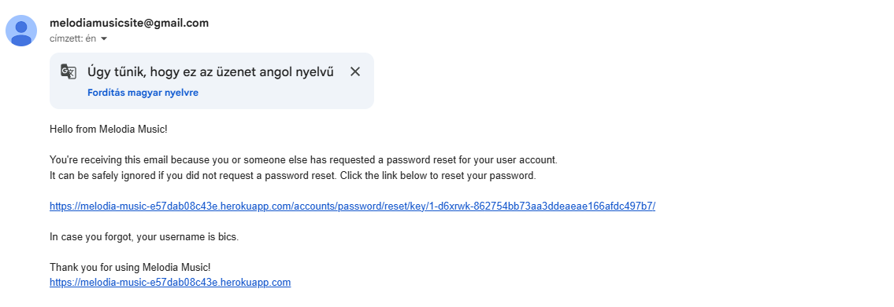
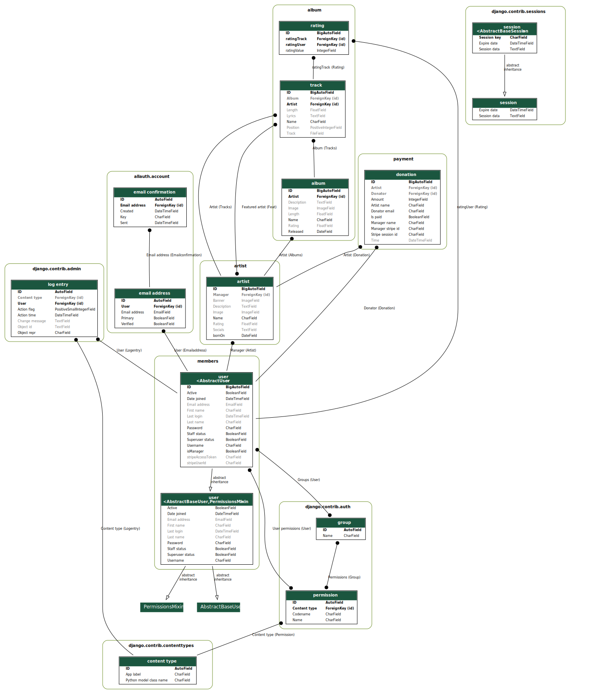

# Melodia

[Deployed site](https://melodia-music-e57dab08c43e.herokuapp.com)\
Use "Ctrl + click" or "CMD + click" to open in new tab

# Table of contents    

1. [UX](#ux)
2. [Features](#features)
    1. [Existing Features](#existing-features)
    2. [Future Features Consideration](#future-features-consideration)
3. [Data](#data)
4. [Technologies used](#technologies-used)
5. [Testing](#testing)
6. [Deployment](#deployment)
7. [Credits](#credits)
8. [Acknowledgements](#acknowledgements)

# UX

### User stories
* First Time Visitor Goals
    * First time users should be able to understand the purpose of the site.
    * They should be able to navigate the site without any issue.
    * The site should encourage users to interact with it.

* Returning Visitor Goals
    * Returning visitors should be able to notice any changes on the website.
    * Changes should be evident to returning visitors

* Frequent User Goals
    * Frequent users should be able to listen and enjoy to uploaded audio files.
    * They should be able to rate uploaded audio files.

### Design

Colour Scheme

Main colours used on the website\

Typography

* Corbel is used with a fallback to Calibri first and then to sans-serif.

### Wireframes

Mobile

Tablet

Desktop

# Features

## Existing features

### Landing page

The landing page is a mix of suggestions.\
On top of the page users can interact with the navigation bar. These could help them locate the pages they wish to visit, or simply look
for any data available about songs, albums and artists.

The first suggestion part is a huge banner with 5 random artists. They ranked by their accumulated rating of all songs.

The next part is a hidden audio player. The player becomes visible, when the user start listening to one the songs.\
Below the player is a table with 10 completely random songs.

The last part is showcasing 10 random artists.

### Account page

On this page users can update their details or initiate password reset\

Users can request manager access. This function does nothing at the moment, but future consideration should be made to include automated
ticket creation for staff to enable manager features for an account.

Once manager access is granted, managers here can (and need to) link their stripe account. The account linking helps to ensure donation
will be received correctly. The page renders the account onboarding status as well, making sure managers are aware if they need to update their stripe account.

### Artist page

The artist page is similar to the landing page, but only focuses on a single artist.\
On top there is the banner image for the artist.\
In the middle is the details of the band/artist. On the left side is the band's/artist's image, and on the right side their socials, description and name. In this part lies the donation button, where users can donate directly (or rather through their agent) to their favourite artist.\

If the artist's manager visits this page, this is were they are able to update their managed artist's details.\
The last part is where all of the artist's albums is displayed. This part also has a hidden audio player, which will be visible once 
one of the songs staring to play.\
In this section manager can add or edit the albums itself.

### Edit artist page

To edit the artists details, manager can navigate to the edit page. Here all the related details for the artists can be updated.

### Album addition/edit

Managers can easily add new albums to their artists. They need to locate the creation button, which navigates them to the creation page.
Here after filling out the form an album is created for the artist.

To edit the album, after navigating to the page, managers can update the albums details, and remove or edit any track details. This ensures all related data manipulation happens on one page.

### Track addition

To add tracks, managers first need to select an album, then after navigating to the addition page they are able to add up to a maximum 12 tracks at a time.\
These achieved using a formset. Additional forms can be added/removed with the respective buttons. Removing a form also clears it so data
will not be saved accidentally.

### Donation page

The donation button is located on the artist page. It is hidden until the manager have managed to acquire their stripe user id.\
The donation page is a very simple form for users to donate to their favourite artists. Here users can choose a small predifined amount or set a custom amount.

After clicking either a predefined or submitting a custom donation the user is redirected to stripe's payment window. Here stripe will validate the users details.

If users decide to go back, they will be redirected to the artist page.\
After the payment succeeded they are redirected to the success page.

### Manage page

On this page, managers can add new artists to the site. This page also allows them to navigate to their managed artists pages easily.

### Rating system

Within the album tables, and the landing page suggestion table, users can rate songs. These ratings are saved via AJAX solely to enable users to listen to the songs, and rate at the same time, as no reload needed.\
Rating for each song in both tables will be shown after a minimum number of submissions. Currently, a rating is shown once at least three ratings have been received.

### Search function

If a user uses the search function, they will be presented with all matching data found.\
These results are categorized so the user should be able to select from each type if data they were looking for.

### Django Allauth's core features

The project is integrated with Django Allauth’s core features. This enables easy user management and provides essential security protections.\
It is used for user creation, user login, user logout, and password management.\
This ensures users have accurate details and enforces strong password usage.

### Cloudinary

This 3rd party media storage service is used to store user-uploaded images.

### Google SMTP service

A dedicated Google account was created and modified to be the messaging client for the project.
This email service was then integrated to support Django Allauth features.
Currently the password reset workflow uses this service.

## Future Feature Considerations

* Global music player: Currently, each audio player is limited to its respective page. Leaving this page will stop the player.
* Playlist creation: Feature could be added so users can create custom playlists. Also, there is a possibility to add auto-generated playlists.
* Favourites: Users could save their favourite songs, and a feedback feature could be implemented based on metadata from these.
* Artists transfer: Feature can be added so managers are able to transfer artists when needed.
* Comment section: A section can be added for each artist, album, or song for users to interact.
* Artists multiple art/image: Currently, only one banner and image can be used for an artist. These could be overhauled to enable multiple images, like an account on social media.
* Multiple suggestions: Currently, suggestions are only filtered by ratings. A couple of new suggestion-based filters can be added for newly added songs/artists or any related data (e.g. similar users’ favourites).
* Background video on artists page. 
* This seems obvious but a discover all artist/songs page. Or a refresh option for suggestion tables. Currently users only find artists if they search for their names, already know them.

# Data

Models

### Melodiauser

The main custom user model.
It includes the base fields inherited from AbstractUser.
Custom fields added:

* isManager: Used to determine whether a user has access to add artists and related objects to the site
* stripeUserId: Used to store the user's Stripe ID for payments
* stripeAccessToken: Currently unused. I followed a guide for the initial steps, abandoned the guide, and left it in case it might be useful

### Artist

The main model for the site. Only managers can add these objects.
Fields are:

* name: Name given by the manager
* description: A custom description given by the manager
* bornOn: Date when the artist/band was born or established, given by the manager
* socials: Social links, given by the manager
* manager: Foreign key of the manager who is maintaining the artist

### Album

Albums are used to contain tracks for artists.
Fields are:

* name: Name given by the manager
* description: A custom description given by the manager
* released: Date when the album was released, given by the manager
* length: Length of all the tracks in the album. Currently unused.
* artist: Foreign key of the artist the album belongs to.

### Track

Track is a model for audio files and their details.
Fields are:

* name: Name given by the manager
* track: Audio file URL. Manages file uploads and references the file itself.
* position: Position in the album given by the manager.
* lyrics: Lyrics for the song given by the manager.
* length: Length of the audio file. Populated on file upload with the help of mutagen.
* album: Foreign key of the album the track is part of.
* artist: Foreign key of the artist the track belongs to.
* featured_artist: Many-to-many field indicating guest artists.

### Rating

Rating object used to store each rating for tracks.
Fields are:

* ratingTrack: Foreign key of the track the rating belongs to.
* ratingUser: Foreign key of the user who rated.
* ratingValue: The actual rating value.

### Donation

Donation is the model used to keep track of payments alongside Stripe.
Fields are:

* amount: Donation amount.
* artist: Foreign key of the artist the donation goes to.
* artist_name: Safekeeping name of the artist in case the artist is deleted.
* manager_name: Name of the artist's current manager.
* manager_stripe_id: Stripe ID of the manager.
* donator: Foreign key of the user who donated.
* donator_email: Safekeeping the email of the user who donated.
* stripe_session_id: Session ID of the Stripe transaction.
* is_paid: Boolean field indicating a successful payment.
* time: Time of the donation, automatically generated.

# Technologies used

* The core project is written in HTML5, CSS3 and Python.
* Used [Visual Studio Code](https://code.visualstudio.com) as IDE.
* Used [Github](https://github.com) to store and deploy the repository.
* Used [Sourcetree](https://www.sourcetreeapp.com) for version control.
* Used [Opera](https://www.opera.com), [Mozilla](https://www.mozilla.org/en-GB/) and [Chrome](https://www.google.com/intl/en_uk/chrome/) browsers and their respective developer tools for testing.
* Used [ChatGPT](https://chatgpt.com) for debugging, code and content generation.
* Used [W3Schools](https://www.w3schools.com) to help to understand and write codes.
* Frequently visited [Stack Overflow](https://stackoverflow.com/questions) to understand some behaviours.
* Used [Bootstrap](https://getbootstrap.com) as css.
* Used [Freepik](https://www.freepik.com) to acquire free images.
* Used [Krita](https://krita.org/en/) and [Canva](https://www.canva.com) for modifying pictures.
* Used [Coolors](https://coolors.co) to create color palette.
* Used [Microsoft Windows](https://www.microsoft.com/en-gb/windows?r=1) in-built **Snippet** tool to capture images.
* Used [Cloudinary](https://cloudinary.com) to store media images.
* Used [PostgreSQL](https://www.postgresql.org) as database.
* Used [Heroku](https://www.heroku.com) as hosting platform.
* Used [Wordmark](https://wordmark.it) to select fonts.
* Used [Canva](https://www.canva.com) to create wireframes.
* Used [Youtube](https://www.youtube.com) with [OnlyMP3 converter](https://en.onlymp3.io/A04/) to acquire audio tracks
* Used [Graphviz](https://graphviz.org) to create DB visualisation.
* Used [WEBP to JPG Converter](https://cloudconvert.com/webp-to-jpg) to convert media files into jpg format.

* Used the [Django web framework](https://www.djangoproject.com), with the following core technologies:

| Name | Purpose |
|------|---------|
| Django | Core |
| django-allauth | User management |
| django-cloudinary-storage | Supports Cloudinary integration |
| cloudinary | Supports Cloudinary integration |
| pillow | Image processing helper |
| whitenoise | Serves static files |
| psycopg2 | PostgreSQL adapter |
| gunicorn | Production WSGI server |
| stripe | Payment processing (Stripe integration) |
| dj-database-url | Database configuration via environment variables |
| mutagen | Audio metadata handling |
| requests | HTTP requests |

# Testing

Testing is extracted to it's own document, [TESTING]()

# Deployment

### Heroku
The project is deployed to [Heroku](https://www.heroku.com). In order to achieve this the following steps were taken:\
1. Sign into [Heroku](https://www.heroku.com).
2. Start creating a new app.
3. Use Github as preferred deployment method. 
4. Connect to your Github account, and connect the corresponding repository.
5. Setup the reqiured environment variables.
    
6. Once it successfully connected select a branch to deploy and hit "Deploy branch".

### Forking a repository

1. Sign into [Github](https://github.com/) (can be done later).
2. On [Github](https://github.com/) locate the [Melodia](https://github.com/bics/Melodia) repository.
3. On the top right hand side click on the "Fork" option.
4. Sign into [Github](https://github.com/) (not needed if step 1. was taken).
5. The repository should be present under your account's repositories.

### Download local repository

1. Navigate to the [Melodia](https://github.com/bics/Melodia) repository.
2. On the right side select the "Code" dropdown menu.
3. Download the repository as a .zip file.
4. Extract the downloaded file.
5. Open up your preferred IDE and add the extracted folder as a project.

### Clone a repository with Sourcetree

1. Import SSH key. If SSH key already imported skip these steps
    1. Acquire the SSH key, and password for this repository.
    2. Locate the "Tools" menu, and select the "Create or import SSH keys" option.
    3. In the dialog select "Load" and locate the acquired SSH key.
    4. If prompted sign in to [Github](https://github.com/) account and enter the password.
2. Click on the "+" icon to add a local repository.
3. Select the "Remote" option on the top navigation bar.
4. Search for the [Melodia](https://github.com/bics/Melodia) repository and hit clone.

# Credits

### Code

* gitgnore copied from previous [CoffeeHouse](https://github.com/bics/CoffeeHouse) project
* base.html copied and modified from previous [CoffeeHouse](https://github.com/bics/CoffeeHouse) project
* Allauth template htmls and forms from previous [CoffeeHouse](https://github.com/bics/CoffeeHouse) project
* Account details update modals was copied from previous [CoffeeHouse](https://github.com/bics/CoffeeHouse) project
* CreateArtistForm helptext update copied from previous [CoffeeHouse](https://github.com/bics/CoffeeHouse) project
* Cloudinary settings copied from previous [CoffeeHouse](https://github.com/bics/CoffeeHouse) project
* Whitenoise middleware addon copied from [W3Schools](https://www.w3schools.com)
* Allauth settings block taken from [official allauth documentation](https://docs.allauth.org/en/latest/)
* Search view inspired by tutorial from [John Elder](https://www.youtube.com/watch?v=AGtae4L5BbI&list=PLCC34OHNcOtqW9BJmgQPPzUpJ8hl49AGy&index=9)

#### Bootstrap

* Navbar block taken from [Bootsrap's official documentation](https://getbootstrap.com/docs/5.3/components/navbar/)
* Carousel code block taken from [Bootsrap's official documentation](https://getbootstrap.com/docs/5.3/components/carousel/)
* Card code block copied from [Bootsrap's official documentation](https://getbootstrap.com/docs/5.3/components/card/)
* Collapse code block copied from [Bootsrap's official documentation](https://getbootstrap.com/docs/5.3/components/collapse/)

#### Stripe

* Form block for members copied from [official stripe marketplace implementation](https://docs.stripe.com/connect/marketplace/quickstart?lang=python)
* Try block copied from [official Stripe documentation](https://docs.stripe.com/connect/marketplace/quickstart?lang=python)
* stripe_account_status.js was copied and modified from [official Stripe documentation](https://docs.stripe.com/connect/marketplace/quickstart?lang=python)
* Try-catch block code for donation view was copied from [official Stripe documentation](https://docs.stripe.com/checkout/quickstart) and [official stripe marketplace implementation](https://docs.stripe.com/connect/marketplace/quickstart?lang=python)
* Webhook handler view was copied from [official Stripe documentation](https://docs.stripe.com/webhooks/quickstart?lang=python) and modified using ChatGPT

#### AI

* Social urlization generated using [ChatGPT](https://chatgpt.com) for artists socials
* GetSocial method partially generated using [ChatGPT](https://chatgpt.com)
* Featured artist query selector generated using [ChatGPT](https://chatgpt.com)
* Formset save partially generated using [ChatGPT](https://chatgpt.com)
* Form reset logic generated using [ChatGPT](https://chatgpt.com)
* Extracting selected option partially generated using [ChatGPT](https://chatgpt.com)
* File upload path partially generated using [ChatGPT](https://chatgpt.com)
* Landing page random object retrieval and sorting generated using [ChatGPT](https://chatgpt.com)
* Audio upload and length retrieval generated using [ChatGPT](https://chatgpt.com)
* Proper length return generated using [ChatGPT](https://chatgpt.com)
* AJAX submission and helper method generated using [ChatGPT](https://chatgpt.com)
* Rate track view generated using [ChatGPT](https://chatgpt.com)
* Tooltip retrieval generated using [ChatGPT](https://chatgpt.com)
* Rating retrieval partially generated using [Claude](https://claude.ai/new)
* Input sanitation for search generated using [ChatGPT](https://chatgpt.com)
* Donation if statement block was partially generated using [ChatGPT](https://chatgpt.com)
* Artist update view decorator was generated using [ChatGPT](https://chatgpt.com)
* startOnboarding and getCookie functions were generated using [Claude](https://claude.ai/new)
* account_status and create_account_link views were generated using [ChatGPT](https://chatgpt.com) and [Claude](https://claude.ai/new)
* Email confirmation template and view update was partially generated using [ChatGPT](https://chatgpt.com)

### Content

* Using core Django Allauth default messages.
* Most artist description generated by [ChatGPT](https://chatgpt.com).
* All other content was written by me.

### Media

* music_note.jpg by [juicy_fish](https://www.freepik.com/free-vector/three-music-notes-floating-upwards_290240060.htm#fromView=search&page=1&position=1&uuid=44844498-6808-4a2e-b6c8-5bcb8592dcd7&query=music+note)

* vinyl_disc by [xadartstudio](https://www.freepik.com/free-psd/vinyl-record-timeless-classic-music_406616720.htm#fromView=search&page=1&position=1&uuid=678e9eb1-3e31-403f-a8fc-c7cd79cc72ea&query=vinyl+disc)

* blank_user_pic by [juicy_fish](https://www.freepik.com/free-vector/blank-user-circles_134996379.htm#fromView=search&page=1&position=1&uuid=9bb78e8c-d30a-4aee-b687-d4a30d3a706a&query=blank+user+picture)

* single_note_tilted generated with from music_note.jpg [ChatGPT]()

* paramore-banner image from [ticketmaster](https://discover.ticketmaster.co.uk/wp-content/uploads/2022/10/paramoreplusone-738x415.jpg)

* paramore-artist-image from [pinterest](https://i.pinimg.com/originals/ca/b7/ec/cab7ecfe04f79e0d8060a996d5b8b648.png)

* paramore-riot from [wikipedia](https://upload.wikimedia.org/wikipedia/en/2/28/Paramore_-_Riot%21.png)

* paramore-brand-new-eyes from [Spotify](https://i.scdn.co/image/ab67616d0000b273e01d7d558032457b0e4883f6)

* paramore-after-laughter from [Society6 Blog -](https://blog.society6.com/app/uploads/2017/05/Paramore-After-Laughter-2017-2480x2480.jpg)

* play-button by [Harryarts](https://www.freepik.com/free-vector/shiny-play-button_840752.htm#fromView=search&page=2&position=2&uuid=d7ab2319-57b8-48a0-8a6c-0f119212bfac&query=play)

* button-set by [juicy_fish](https://www.freepik.com/free-vector/multimedia-buttons-cartoon-style_417881887.htm#fromView=search&page=1&position=22&uuid=c850db0d-cdaf-499e-b251-fc2edcdd8e09&query=pause+button)

* pause-button by [rawpixel.com](https://www.freepik.com/free-vector/stop-button_2900766.htm#fromView=search&page=1&position=3&uuid=c850db0d-cdaf-499e-b251-fc2edcdd8e09&query=pause+button)

* play_button_small and pause_button_small was generated using [ChatGPT](https://chatgpt.com)

* empty_banner_with_drums by [pvproductions](https://www.freepik.com/free-photo/drum-set-black-background-isolated-copy-space_174141486.htm#fromView=search&page=1&position=7&uuid=1fc10dad-c6d4-4960-bf19-cc3b5960fb87&query=empty+band+banner+template)

* empty_album_cover by [luis_molinero](https://www.freepik.com/free-vector/view-texture-case-media-front_1135006.htm#fromView=search&page=1&position=6&uuid=2370de03-3a18-4e84-bd96-310043a57c84&query=empty+album+cover)

* rating_star_full by [mamewmy](https://www.freepik.com/free-psd/star-winner-rating-review-icon-sign-symbol-3d-background-illustration_71291981.htm#fromView=search&page=1&position=1&uuid=2f9670c6-78f3-4fd5-9fc4-1902548287df&query=rating+star)

* rating_star_gray was generated using [ChatGPT](https://chatgpt.com)

* rating_star_full_transbg modified using [removebg](https://www.remove.bg/hu/upload)

* All tracks were downloaded from [Youtube](https://www.youtube.com) using [OnlyMP3 converter](https://en.onlymp3.io/A04/)

####  Multimedia zip file contains media files used as data on the website

Multimedia credits

* All audio files are sourced from [Youtube](https://www.youtube.com), downlloaded with [OnlyMP3 converter](https://en.onlymp3.io/A04/) 

* blink182_pfp from [google images](https://www.google.com/imgres?q=blink182&imgurl=https%3A%2F%2Fyt3.googleusercontent.com%2FLibG3wCv6pzHURjVeCmLEXZ07NF9vBk3GobIYdCOA734aG3QObFaMnnVGwoeDpfMxh_V2dU6WR4%3Ds900-c-k-c0x00ffffff-no-rj&imgrefurl=https%3A%2F%2Fwww.youtube.com%2Fuser%2Fblink182&docid=E92JMzIG-hRT_M&tbnid=I89af7c00wYcgM&vet=12ahUKEwjQ6MHa4PeTAxVzVUEAHen_IOIQnPAOegQIGxAB..i&w=900&h=900&hcb=2&ved=2ahUKEwjQ6MHa4PeTAxVzVUEAHen_IOIQnPAOegQIGxAB)

* b182_banner from [google images](https://www.google.com/imgres?q=blink%20182%20banner%20jpg&imgurl=https%3A%2F%2Fwww.prints4u.net%2Fwp-content%2Fuploads%2F2019%2F11%2FBlink_182_022.jpg&imgrefurl=https%3A%2F%2Fwww.prints4u.net%2Fproduct%2Fblink-182-london-o2-arena-june-9th-2012%2F&docid=1zgpJ4sH062ntM&tbnid=OI74wznBHJ7kEM&vet=12ahUKEwi1ucin4_eTAxVadUEAHdQ6Dx0QnPAOegQILRAB..i&w=1024&h=719&hcb=2&ved=2ahUKEwi1ucin4_eTAxVadUEAHdQ6Dx0QnPAOegQILRAB)

* yellow_spots_pfp from [goggle images](https://www.google.com/imgres?q=yellow%20spots%20zenekar&imgurl=https%3A%2F%2Frockdiszkont.hu%2Fkepek%2Fnagy_kepek%2Frockdiszkont_kepek%2Fyellow_spots_agylebenyflort.jpg&imgrefurl=https%3A%2F%2Frockdiszkont.hu%2Fcd-magyar%2Fx-y%2Fyellow-spots-agylebenyflort-cd&docid=cFxjhEygiqjU0M&tbnid=bv_O2LbQzszZOM&vet=12ahUKEwjekILD4feTAxVBnf0HHYsvBqsQnPAOegQIIxAB..i&w=300&h=425&hcb=2&itg=1&ved=2ahUKEwjekILD4feTAxVBnf0HHYsvBqsQnPAOegQIIxAB)

* ys_banner from [google images](https://www.google.com/imgres?q=yellow%20spots%20zenekar%20banner%20jpg&imgurl=https%3A%2F%2Fimages.zoogletools.com%2Fs%3Abzglfiles%2Fu%2F395834%2F4c7b38b396113f4181cc17401593b90e5ba7d180%2Foriginal%2Fyellow-spots-17-45.jpg%2F!!%2Fb%253AW1sicmVzaXplIiwxODAwXSxbIm1heCJdLFsid2UiXV0%253D%2Fmeta%253AeyJzcmNCdWNrZXQiOiJiemdsZmlsZXMifQ%253D%253D.jpg&imgrefurl=https%3A%2F%2Fwww.yellowspots.hu%2F&docid=33mqEN6ov6YVZM&tbnid=GHfvh9xa88DZaM&vet=12ahUKEwjh29SF4_eTAxUIUUEAHa44ObsQnPAOegQIFxAB..i&w=1800&h=713&hcb=2&ved=2ahUKEwjh29SF4_eTAxUIUUEAHa44ObsQnPAOegQIFxAB) converted with [WEBP to JPG Converter](https://cloudconvert.com/webp-to-jpg)

* panic_at_the_disco_pfp from [google images](https://www.google.com/imgres?q=panic%20at%20the%20disco&imgurl=https%3A%2F%2Fi.ytimg.com%2Fvi%2FaIs7QtCsUAg%2Fhq720.jpg%3Fsqp%3D-oaymwEhCK4FEIIDSFryq4qpAxMIARUAAAAAGAElAADIQj0AgKJD%26rs%3DAOn4CLA9qmDvku_cM_vqRXqEv7ulWAao0A&imgrefurl=https%3A%2F%2Fwww.youtube.com%2Fwatch%3Fv%3DaIs7QtCsUAg&docid=gu9ZQYspjxTekM&tbnid=1aaspVfwvNWTJM&vet=12ahUKEwj-8OPf4feTAxUinf0HHfUTFhAQnPAOegQIJBAB..i&w=686&h=386&hcb=2&ved=2ahUKEwj-8OPf4feTAxUinf0HHfUTFhAQnPAOegQIJBAB)

* patd_banner from [google images](https://www.google.com/imgres?q=panic%20at%20the%20disco&imgurl=http%3A%2F%2Fstatic1.squarespace.com%2Fstatic%2F589defeb6b8f5b337d753c88%2Ft%2F68f65ef0810918462e46b18d%2F1760976624320%2Fpatdlink.png%3Fformat%3D1500w&imgrefurl=https%3A%2F%2Fpanicatthedisco.com%2F&docid=zDBuIiqPlJYdCM&tbnid=3LgfwV6GjAYQ-M&vet=12ahUKEwj-8OPf4feTAxUinf0HHfUTFhAQnPAOegQIWRAB..i&w=1200&h=627&hcb=2&ved=2ahUKEwj-8OPf4feTAxUinf0HHfUTFhAQnPAOegQIWRAB) transformed with [WEBP to JPG Converter](https://cloudconvert.com/webp-to-jpg)

* tc_banner from [google images](https://www.google.com/imgres?q=tom%20cardy%20banner%20jpg&imgurl=https%3A%2F%2Fhappymag.tv%2Fwp-content%2Fuploads%2F2023%2F11%2FSite-Takeover-3000-x-1000-21-scaled.jpg&imgrefurl=https%3A%2F%2Fhappymag.tv%2Finterview-tom-cardy%2F&docid=BxmNbpFrNOAu_M&tbnid=8yc8ZmenSynizM&vet=12ahUKEwjdk5by4_eTAxXeQEEAHbMDHbQQnPAOegQIORAB..i&w=2560&h=853&hcb=2&ved=2ahUKEwjdk5by4_eTAxXeQEEAHbMDHbQQnPAOegQIORAB)

* tc_pfp from [google images](https://www.google.com/imgres?q=tom%20cardy&imgurl=https%3A%2F%2Ff4.bcbits.com%2Fimg%2F0025683405_10.jpg&imgrefurl=https%3A%2F%2Ftomcardy.bandcamp.com%2F&docid=Iv0dTMQTgPZ6VM&tbnid=-LwU4ZV1pxHfOM&vet=12ahUKEwiSptOP5PeTAxVTXUEAHYObG3oQnPAOegQIKBAB..i&w=1200&h=800&hcb=2&ved=2ahUKEwiSptOP5PeTAxVTXUEAHYObG3oQnPAOegQIKBAB)

* lp_banner from [google images](https://www.google.com/imgres?q=linkin%20park&imgurl=https%3A%2F%2Fwww.nme.com%2Fwp-content%2Fuploads%2F2016%2F09%2F2012LinkinParkPR180412-1.jpg&imgrefurl=https%3A%2F%2Fwww.nme.com%2Fnews%2Fmusic%2Flinkin-park-28-1260262&docid=JueJONs1cnAHmM&tbnid=ZiTD8mnvTayAlM&vet=12ahUKEwi4hJek5PeTAxVLW0EAHVNpI-wQnPAOegQIIBAB..i&w=900&h=600&hcb=2&ved=2ahUKEwi4hJek5PeTAxVLW0EAHVNpI-wQnPAOegQIIBAB)

* lp_pfp from [google images](https://www.google.com/imgres?q=linkin%20park&imgurl=https%3A%2F%2Fyt3.googleusercontent.com%2FOtUf050j6w6iRPUmGgmzblD2saluxUusxiVmo0-SMUnWiNKwR89JL_-xJ6JvIEram8UbPT_zDA%3Ds900-c-k-c0x00ffffff-no-rj&imgrefurl=https%3A%2F%2Fwww.youtube.com%2Fchannel%2FUCZU9T1ceaOgwfLRq7OKFU4Q&docid=XdYT3-6wbrTPDM&tbnid=falbcetbK1Xn1M&vet=12ahUKEwi4hJek5PeTAxVLW0EAHVNpI-wQnPAOegQIKBAB..i&w=900&h=900&hcb=2&ved=2ahUKEwi4hJek5PeTAxVLW0EAHVNpI-wQnPAOegQIKBAB#sv=CAMSXhoyKhBlLUl6WUYtc3E0ZGttYlBNMg5JellGLXNxNGRrbWJQTToONFl6SXYxVkFSOHc2dk0gBCokCg5walk4YWNDWTgxQ29sTRIQZS1JellGLXNxNGRrbWJQTRgAMAEYByCX0uzmA0oIEAEYASABKAE)

* nsp_pfp from [google images](https://www.google.com/imgres?q=ninja%20sex%20party&imgurl=https%3A%2F%2Fyt3.googleusercontent.com%2FAkLtfdx1-UCNVKkt6PmKtoB9VGY5GjUpjgGPbI6AqrsZMaM3g75Bjwq2fomKCOb1vJQ9tgd_%3Ds900-c-k-c0x00ffffff-no-rj&imgrefurl=https%3A%2F%2Fwww.youtube.com%2Fuser%2FNinjaSexParty&docid=ca-oiyfmrRFS0M&tbnid=4S8yIKlN3V-mHM&vet=12ahUKEwign8Lf5PeTAxU6UkEAHbvoKd0QnPAOegQIKxAB..i&w=900&h=900&hcb=2&ved=2ahUKEwign8Lf5PeTAxU6UkEAHbvoKd0QnPAOegQIKxAB)

* nsp_banner from [google images](https://www.google.com/imgres?q=ninja%20sex%20party&imgurl=https%3A%2F%2Fdynamicmedia.livenationinternational.com%2Ft%2Fl%2Fz%2Fe9e9c1af-71e7-4598-9b57-be7961af6419.jpg%3Fformat%3Dwebp%26width%3D3840%26quality%3D75&imgrefurl=https%3A%2F%2Fwww.livenation.co.uk%2Fninja-sex-party-tickets-adp1266461&docid=MZcHdvEqSK2OZM&tbnid=jnLVHScMdeMIgM&vet=12ahUKEwign8Lf5PeTAxU6UkEAHbvoKd0QnPAOegQIGRAB..i&w=1920&h=1080&hcb=2&ved=2ahUKEwign8Lf5PeTAxU6UkEAHbvoKd0QnPAOegQIGRAB) converted with [WEBP to JPG Converter](https://cloudconvert.com/webp-to-jpg)

* bt_pfp from [google images](https://www.google.com/imgres?q=billy%20talent&imgurl=https%3A%2F%2Fyt3.googleusercontent.com%2FcK0eOn3NXDY4IMyBw4-_6_OwNlpr8fDeq8TzisVuV7sHC_SZm_ol3R9simPYeX3RLytaJDK5qg%3Ds900-c-k-c0x00ffffff-no-rj&imgrefurl=https%3A%2F%2Fwww.youtube.com%2Fbillytalent&docid=GByj_11eNorRNM&tbnid=-CQrNsx8QXhfFM&vet=12ahUKEwiUl7OW5feTAxV1RUEAHStiCQkQnPAOegQIFxAB..i&w=900&h=900&hcb=2&ved=2ahUKEwiUl7OW5feTAxV1RUEAHStiCQkQnPAOegQIFxAB)

* bt_banner from [google images](https://www.google.com/imgres?q=billy%20talent%20banner&imgurl=https%3A%2F%2Fstore.billytalent.com%2Fcdn%2Fshop%2Ffiles%2Fbt_shop2024_newmerch2_cc57e40c-6293-46cf-971b-3d1919c1974b.png%3Fv%3D1713881479%26width%3D900&imgrefurl=https%3A%2F%2Fstore.billytalent.com%2Fen&docid=OoLyyhqpb1u8uM&tbnid=mL2Y0h6Y0njNjM&vet=12ahUKEwja4t7D5feTAxUwQ0EAHS2fO8QQnPAOegQIFxAB..i&w=900&h=449&hcb=2&ved=2ahUKEwja4t7D5feTAxUwQ0EAHS2fO8QQnPAOegQIFxAB) converted with [WEBP to JPG Converter](https://cloudconvert.com/webp-to-jpg)

* s41_banner from [google images](https://www.google.com/imgres?q=sum41&imgurl=https%3A%2F%2Fmedia.altpress.com%2Ffkdgxpscnt%2Fuploads%2F2023%2F01%2F07%2Fattachment-THE-ANTHEM-012423-1200x628-2.jpg&imgrefurl=https%3A%2F%2Fwww.altpress.com%2Fsum-41-still-waiting-oral-history%2F&docid=S-DzMqY5rWGyiM&tbnid=FF93ogpP97mfCM&vet=12ahUKEwjP2eDf5feTAxV1dUEAHdFYBZgQnPAOegQIGBAB..i&w=1200&h=628&hcb=2&ved=2ahUKEwjP2eDf5feTAxV1dUEAHdFYBZgQnPAOegQIGBAB)

* s41_pfp from [google images](https://www.google.com/imgres?q=sum41%20logo&imgurl=http%3A%2F%2Fhurly-burly.com.au%2Fcdn%2Fshop%2Fproducts%2FAnarchy_Iron_on_Patch_4608cf44-7f30-4471-9083-0c3d7f7c8d20.jpg%3Fv%3D1640060121&imgrefurl=https%3A%2F%2Fhurly-burly.com.au%2Fproducts%2Fsum-41-iron-on-patch%3Fsrsltid%3DAfmBOorm3PP-lhteUFN0xHnCXpIVkFaxwkxwXHjsVhsFi86wCZZP5_ei&docid=tVHgrPK67jxIeM&tbnid=i1gKh8qkGnxQBM&vet=12ahUKEwiwiomd5veTAxXNVkEAHS69IvM4ChCc8A56BAhkEAE..i&w=534&h=600&hcb=2&ved=2ahUKEwiwiomd5veTAxXNVkEAHS69IvM4ChCc8A56BAhkEAE)

* enema_of_the_state from [google images](https://www.google.com/imgres?q=enema%20of%20the%20state&imgurl=https%3A%2F%2Ftownsquare.media%2Fsite%2F366%2Ffiles%2F2019%2F03%2FBlink-182-Enema-of-the-State.jpg%3Fw%3D1200%26h%3D0%26zc%3D1%26s%3D0%26a%3Dt%26q%3D89&imgrefurl=https%3A%2F%2Floudwire.com%2Fblink-182-enema-of-the-state-in-full%2F&docid=i6VXQBX_CJnAgM&tbnid=8Kd-0O3zaQMLhM&vet=12ahUKEwjn_bOO6feTAxW4RkEAHRZZNZ8QnPAOegQILBAB..i&w=1200&h=800&hcb=2&ved=2ahUKEwjn_bOO6feTAxW4RkEAHRZZNZ8QnPAOegQILBAB) converted with [WEBP to JPG Converter](https://cloudconvert.com/webp-to-jpg)

* take_off_your_pants_and_jacket from [google images](https://www.google.com/imgres?q=take%20of%20your%20pants%20and%20jacket&imgurl=https%3A%2F%2Fupload.wikimedia.org%2Fwikipedia%2Fen%2Fd%2Fde%2FBlink-182_-_Take_Off_Your_Pants_and_Jacket_cover.jpg&imgrefurl=https%3A%2F%2Fen.wikipedia.org%2Fwiki%2FTake_Off_Your_Pants_and_Jacket&docid=hHpW2ygkyU0yyM&tbnid=g0VzbY6Ctk3J5M&vet=12ahUKEwjOnMmp6veTAxVIWEEAHTi6OI4QnPAOegQIHRAB..i&w=316&h=316&hcb=2&ved=2ahUKEwjOnMmp6veTAxVIWEEAHTi6OI4QnPAOegQIHRAB#sv=CAMSXhoyKhBlLXdDZ3BkVGROOVpNcWdNMg53Q2dwZFRkTjlaTXFnTToOM1ZqbXhseVpZZzhFQ00gBCokCg5vN01DRzlYbDdUZVllTRIQZS13Q2dwZFRkTjlaTXFnTRgAMAEYByDilfXpAUoIEAEYASABKAE)

* all_killer_no_filler from [google images](https://www.google.com/imgres?q=all%20killer%20no%20filler&imgurl=https%3A%2F%2Fupload.wikimedia.org%2Fwikipedia%2Fen%2F3%2F30%2FSum_41_All_Killer_No_Filler.jpg&imgrefurl=https%3A%2F%2Fen.wikipedia.org%2Fwiki%2FAll_Killer_No_Filler&docid=YDceVYkn-tQMkM&tbnid=elbwMe51fhobCM&vet=12ahUKEwjd9vuX7_eTAxWVWkEAHayfOk4QnPAOegQIGxAB..i&w=302&h=300&hcb=2&ved=2ahUKEwjd9vuX7_eTAxWVWkEAHayfOk4QnPAOegQIGxAB)

* vices_and_virtues from [google images](https://www.google.com/imgres?q=Vices%20%26%20Virtues&imgurl=https%3A%2F%2Fwww.emp.co.uk%2Fdw%2Fimage%2Fv2%2FBBQV_PRD%2Fon%2Fdemandware.static%2F-%2FSites-master-emp%2Fdefault%2Fdwacb36f8b%2Fimages%2F1%2F9%2F5%2F7%2F195786.jpg%3Fsw%3D1000%26sh%3D800%26sm%3Dfit%26sfrm%3Dpng&imgrefurl=https%3A%2F%2Fwww.emp.co.uk%2Fp%2Fvices-%2526-virtues%2F195786.html&docid=N-QrhXALGUF0KM&tbnid=z7_7NB4m58rMZM&vet=12ahUKEwiqnsC98PeTAxUfWEEAHZhKNaYQnPAOegQILBAB..i&w=800&h=800&hcb=2&ved=2ahUKEwiqnsC98PeTAxUfWEEAHZhKNaYQnPAOegQILBAB) converted with [WEBP to JPG Converter](https://cloudconvert.com/webp-to-jpg)

* bfs_banner from [google images](https://www.google.com/imgres?q=bowling%20for%20soup&imgurl=https%3A%2F%2Fstatic.wixstatic.com%2Fmedia%2Ff735d2_821d02c8d5524015b0760542bd7976ae~mv2.jpg%2Fv1%2Ffill%2Fw_1600%2Ch_630%2Cal_c%2Ff735d2_821d02c8d5524015b0760542bd7976ae~mv2.jpg&imgrefurl=https%3A%2F%2Fwww.bowlingforsoup.com%2F&docid=ybjmyV7OWS4pkM&tbnid=eLmsNH2TU277cM&vet=12ahUKEwjn5tLI8feTAxVfVkEAHU-GAdkQnPAOegQILRAB..i&w=1600&h=630&hcb=2&ved=2ahUKEwjn5tLI8feTAxVfVkEAHU-GAdkQnPAOegQILRAB)

* bfs_pfp from [google images](https://www.google.com/imgres?q=bowling%20for%20soup&imgurl=https%3A%2F%2Fdiscover.ticketmaster.co.uk%2Fwp-content%2Fuploads%2F2024%2F11%2FBowlingForSoup-scaled-e1730734755855-738x415.jpeg&imgrefurl=https%3A%2F%2Fdiscover.ticketmaster.co.uk%2Fmusic%2Fbowling-for-soup-talk-20-years-of-a-hangover-you-dont-deserve-63271%2F&docid=6ll_3MlGCQZUxM&tbnid=eLxtFoFYgZQUZM&vet=12ahUKEwjn5tLI8feTAxVfVkEAHU-GAdkQnPAOegQIIxAB..i&w=738&h=415&hcb=2&ved=2ahUKEwjn5tLI8feTAxVfVkEAHU-GAdkQnPAOegQIIxAB)

* od_pfp from [google images](https://www.google.com/imgres?q=okilly%20dokily&imgurl=https%3A%2F%2Ff4.bcbits.com%2Fimg%2Fa2379607700_10.jpg&imgrefurl=https%3A%2F%2Fokillydokilly.bandcamp.com%2F&docid=gwrCM9ncQU3YqM&tbnid=JUc0mI9Z_4lgDM&vet=12ahUKEwjJvJuQ8veTAxWJSEEAHSlfGGEQnPAOegQIJRAB..i&w=1200&h=1200&hcb=2&ved=2ahUKEwjJvJuQ8veTAxWJSEEAHSlfGGEQnPAOegQIJRAB)

* od_banner from [google images](https://www.google.com/imgres?q=okilly%20dokily&imgurl=https%3A%2F%2Fi.ytimg.com%2Fvi%2F5wrLW9dCPAs%2Fmaxresdefault.jpg&imgrefurl=https%3A%2F%2Fwww.youtube.com%2Fwatch%3Fv%3D5wrLW9dCPAs&docid=Jw4jGmwwjP_l2M&tbnid=LteidepT54OAcM&vet=12ahUKEwjJvJuQ8veTAxWJSEEAHSlfGGEQnPAOegQIIRAB..i&w=1280&h=720&hcb=2&ved=2ahUKEwjJvJuQ8veTAxWJSEEAHSlfGGEQnPAOegQIIRAB)

* Howdilly_Doodilly from [google images](https://www.google.com/imgres?q=Howdilly%20Doodilly&imgurl=https%3A%2F%2Fimages-wixmp-ed30a86b8c4ca887773594c2.wixmp.com%2Ff%2F23628312-cde0-4363-923a-d4ce860cf95e%2Fdaugrz1-61f0fb42-e425-4dfd-804f-4c68528701ce.png%2Fv1%2Ffill%2Fw_800%2Ch_800%2Cq_80%2Cstrp%2Fokilly_dokilly___howdilly_doodilly_commission_by_jmkohrs_daugrz1-fullview.jpg%3Ftoken%3DeyJ0eXAiOiJKV1QiLCJhbGciOiJIUzI1NiJ9.eyJzdWIiOiJ1cm46YXBwOjdlMGQxODg5ODIyNjQzNzNhNWYwZDQxNWVhMGQyNmUwIiwiaXNzIjoidXJuOmFwcDo3ZTBkMTg4OTgyMjY0MzczYTVmMGQ0MTVlYTBkMjZlMCIsIm9iaiI6W1t7InBhdGgiOiIvZi8yMzYyODMxMi1jZGUwLTQzNjMtOTIzYS1kNGNlODYwY2Y5NWUvZGF1Z3J6MS02MWYwZmI0Mi1lNDI1LTRkZmQtODA0Zi00YzY4NTI4NzAxY2UucG5nIiwiaGVpZ2h0IjoiPD04MDAiLCJ3aWR0aCI6Ijw9ODAwIn1dXSwiYXVkIjpbInVybjpzZXJ2aWNlOmltYWdlLndhdGVybWFyayJdLCJ3bWsiOnsicGF0aCI6Ii93bS8yMzYyODMxMi1jZGUwLTQzNjMtOTIzYS1kNGNlODYwY2Y5NWUvam1rb2hycy00LnBuZyIsIm9wYWNpdHkiOjk1LCJwcm9wb3J0aW9ucyI6MC40NSwiZ3Jhdml0eSI6ImNlbnRlciJ9fQ.W4bQ-FGr_Z0JrVfAXdDhB_AAUNOR4oMY8GNev_yA3wE&imgrefurl=https%3A%2F%2Fwww.deviantart.com%2Fjmkohrs%2Fart%2FOkilly-Dokilly-Howdilly-Doodilly-Commission-655832989&docid=Oxdp8_eDj68ryM&tbnid=hR7EOxNFTuMdgM&vet=12ahUKEwjj1rX48_eTAxU5WEEAHRJrAcwQnPAOegQIHBAB..i&w=800&h=800&hcb=2&itg=1&ved=2ahUKEwjj1rX48_eTAxU5WEEAHRJrAcwQnPAOegQIHBAB)

* korn_pfp from [google images](https://www.google.com/imgres?q=korn&imgurl=https%3A%2F%2Fimages.sk-static.com%2Fimages%2Fmedia%2Fprofile_images%2Fartists%2F202975%2Fhuge_avatar&imgrefurl=https%3A%2F%2Fwww.songkick.com%2Fartists%2F202975-korn&docid=WWjmSEM5Z9-axM&tbnid=Dy72O4Tu3dKhKM&vet=12ahUKEwjp_8yK9_eTAxVadUEAHU_ODhYQnPAOegQIIRAB..i&w=300&h=300&hcb=2&ved=2ahUKEwjp_8yK9_eTAxVadUEAHU_ODhYQnPAOegQIIRAB#sv=CAMSXhoyKhBlLVVKYkhOaWJXNmFKWjFNMg5VSmJITmliVzZhSloxTToOYmNoQ21Mc190eVVpU00gBCokCg5EeTcyTzRUdTNkS2hLTRIQZS1VSmJITmliVzZhSloxTRgAMAEYByCl18SaD0oIEAEYASABKAE)

* korn_banner from [google images](https://www.google.com/imgres?q=korn&imgurl=https%3A%2F%2Fstatic.wikia.nocookie.net%2Fmusic%2Fimages%2F1%2F1c%2FKorn.jpg%2Frevision%2Flatest%3Fcb%3D20081213160643&imgrefurl=https%3A%2F%2Fmusic.fandom.com%2Fwiki%2FKorn&docid=v6qwBQf5egRzUM&tbnid=WHTnEbuP87b2XM&vet=12ahUKEwjp_8yK9_eTAxVadUEAHU_ODhYQnPAOegQIKhAB..i&w=1024&h=768&hcb=2&ved=2ahUKEwjp_8yK9_eTAxVadUEAHU_ODhYQnPAOegQIKhAB) converted with [WEBP to JPG Converter](https://cloudconvert.com/webp-to-jpg)

* greatest_hits from [google images](https://www.google.com/imgres?q=korn%20word%20up&imgurl=https%3A%2F%2Fi.ytimg.com%2Fvi%2F-M7vOnlcLbo%2Fmaxresdefault.jpg&imgrefurl=https%3A%2F%2Fwww.youtube.com%2Fwatch%3Fv%3D-M7vOnlcLbo&docid=tLPO--JYROvd-M&tbnid=fqGr0NztKJIgDM&vet=12ahUKEwijp72V-PeTAxWRXEEAHUJJMMMQnPAOegQIFRAB..i&w=1280&h=720&hcb=2&ved=2ahUKEwijp72V-PeTAxWRXEEAHUJJMMMQnPAOegQIFRAB)

* r_pfp from [google images](https://www.google.com/imgres?q=rammstein&imgurl=https%3A%2F%2Fi.scdn.co%2Fimage%2Fab6761610000e5eb32845b1556f9dbdfe8ee6575&imgrefurl=https%3A%2F%2Fopen.spotify.com%2Fartist%2F6wWVKhxIU2cEi0K81v7HvP&docid=75gKL1DNPpuK4M&tbnid=zDkfv8EBw_rQfM&vet=12ahUKEwj2n5Pn-PeTAxUwdUEAHenBB7YQnPAOegQIGRAB..i&w=640&h=640&hcb=2&ved=2ahUKEwj2n5Pn-PeTAxUwdUEAHenBB7YQnPAOegQIGRAB#sv=CAMSXhoyKhBlLWRyRFA1bFpLNk1vRzFNMg5kckRQNWxaSzZNb0cxTToObmU5dGI2NHFsWGpLME0gBCokCg56RGtmdjhFQndfclFmTRIQZS1kckRQNWxaSzZNb0cxTRgAMAEYByCf9JnBDUoIEAEYASABKAE)

* r_banner from [google images](https://www.google.com/imgres?q=rammstein&imgurl=https%3A%2F%2Fimg.youtube.com%2Fvi%2FW3q8Od5qJio%2Fmaxresdefault.jpg&imgrefurl=https%3A%2F%2Fwww.loudersound.com%2Ffeatures%2Fthe-story-behind-the-song-rammsteins-du-hast&docid=A8I7F7WycFn8PM&tbnid=A_Zb_ba9jCdjkM&vet=12ahUKEwj2n5Pn-PeTAxUwdUEAHenBB7YQnPAOegQIKhAB..i&w=1280&h=720&hcb=2&ved=2ahUKEwj2n5Pn-PeTAxUwdUEAHenBB7YQnPAOegQIKhAB)

# Acknowledgements

Thank you to Kevin Loughrey, our cohort leader, for his continuous support and feedback during development.